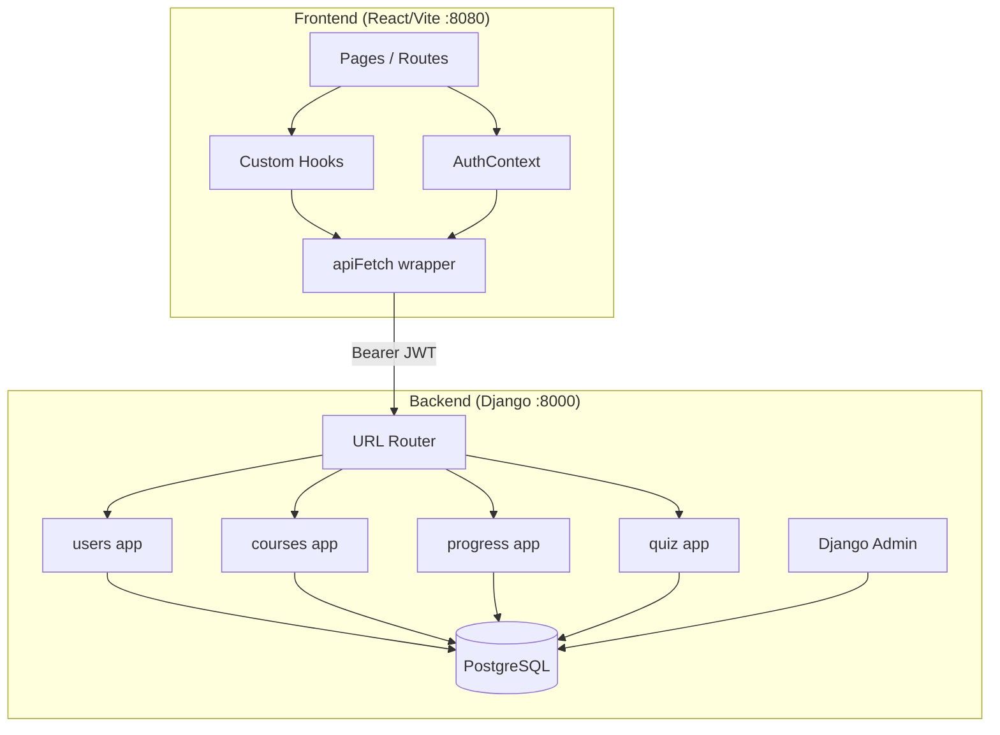
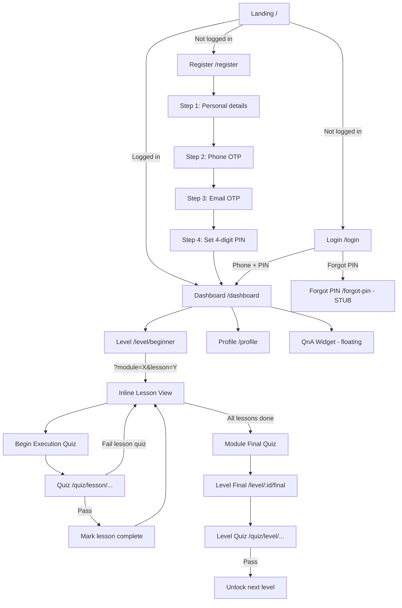

# TradeMaster (Trader Tactical) — Codebase Analysis Report

**Generated:** June 16, 2026  
**Purpose:** Full map of UI, frontend, backend, user flows, and button/functionality status for comparison with a similar platform.

---

## Table of Contents

1. [Executive Summary](#1-executive-summary)
2. [Platform Overview](#2-platform-overview)
3. [Tech Stack](#3-tech-stack)
4. [Architecture](#4-architecture)
5. [User Flow & Website Journey](#5-user-flow--website-journey)
6. [Frontend Analysis](#6-frontend-analysis)
7. [Backend Analysis](#7-backend-analysis)
8. [API Integration Map](#8-api-integration-map)
9. [Button & Functionality Audit](#9-button--functionality-audit)
10. [Known Issues & Gaps](#10-known-issues--gaps)
11. [Comparison Checklist (vs Old Platform)](#11-comparison-checklist-vs-old-platform)
12. [Manual Testing Checklist](#12-manual-testing-checklist)

---

## 1. Executive Summary

**TradeMaster** is an options-trading education LMS (Learning Management System) with a tactical/military-themed UI. Users register with phone + email OTP verification, log in with a 4-digit PIN, and progress through three levels (Beginner → Intermediate → Advanced) containing modules, lessons, and quizzes.

| Area | Status |
|------|--------|
| Landing page & marketing UI | ✅ Mostly static, navigation works |
| Auth (register, login, verify) | ✅ Wired to backend |
| Dashboard & level navigation | ⚠️ Works with caveats (enrollment mapping broken) |
| Lesson reading & progress | ✅ Works |
| Quizzes | ⚠️ Submit works; cooldowns stubbed; answers exposed in API |
| Profile editing | ✅ Works |
| Forgot PIN | ❌ Stub only — no backend |
| Feedback form | ❌ Wrong API URL |
| Legal pages (Privacy, Terms) | ❌ Routes missing → 404 |
| Change password | ❌ API exists, no UI |

**Brand naming inconsistency:** Repo folder is `trader-tactical`, localStorage key is `trader_tactical_auth_tokens`, but UI displays **TradeMaster**.

---

## 2. Platform Overview

### What This Platform Does

- **Public marketing site** — Hero, about, levels preview, how-it-works, testimonials, FAQ, contact
- **User accounts** — Phone + email OTP, 4-digit PIN (stored as Django password)
- **Course structure** — Course → Levels (Beginner/Intermediate/Advanced) → Modules → Lessons
- **Assessments** — Lesson quizzes, module final quizzes, level final quizzes
- **Progress tracking** — Lesson/module/level completion, streaks, unlock logic
- **Admin** — Django admin for content (courses, lessons, quizzes) via CKEditor 5

### Content Hierarchy (Backend)

```
Course (e.g. "Options Trading")
 └── Level (Beginner, Intermediate, Advanced) — order 1, 2, 3
      └── Module (e.g. "Derivatives Basics")
           └── Lesson (rich HTML content via CKEditor)
                ├── FAQs
                ├── Takeaways
                └── Quiz (1:1)
      └── Module Quiz (optional)
 └── Level Quiz (optional)
```

### Frontend ID Mapping

The frontend uses string slugs; the backend uses integer IDs:

| Frontend slug | Backend level order | Mapped int |
|---------------|---------------------|------------|
| `beginner` | 1 | 1 |
| `intermediate` | 2 | 2 |
| `advanced` | 3 | 3 |

Module/lesson IDs are parsed from strings like `module-1` or raw integers depending on context.

---

## 3. Tech Stack

### Frontend (`frontend/`)

| Technology | Version / Notes |
|------------|-----------------|
| React | 18.3 |
| TypeScript | 5.8 |
| Vite | 5.4 |
| React Router | 6.30 |
| TanStack Query | 5.83 (provider set up, **not used** — all data via custom hooks) |
| shadcn/ui + Radix | Full component library |
| Tailwind CSS | 3.4 |
| Zod + React Hook Form | Form validation |
| Recharts | Charts (available, limited use) |

### Backend (`backend/`)

| Technology | Notes |
|------------|-------|
| Django | 6.0 (settings say 6.0; venv may have 5.2) |
| Django REST Framework | All API endpoints |
| SimpleJWT | Access (30 min) + Refresh (1 day) |
| PostgreSQL | Default DB (`lms_db`, user `django`) |
| django-ckeditor-5 | Rich lesson content |
| django-nested-admin | Nested quiz question/option admin |
| django-phonenumber-field | User phone numbers |
| Moplet SMS | OTP delivery |
| Gmail SMTP | Email OTP + feedback/QnA |

### Environment

**Frontend** (`frontend/.env`):
```
VITE_API_BASE_URL="http://localhost:8000"
```

**Backend** (`.env` at project root, loaded via `python-dotenv`):
- `SECRET_KEY`, `EMAIL_HOST_USER`, `EMAIL_HOST_PASSWORD`
- `MOPLET_API_KEY`, `MOPLET_SENDER_ID`
- `FEEDBACK_RECIPIENT`

---

## 4. Architecture



### Data Flow Pattern

1. `AuthContext` loads tokens from `localStorage`, fetches `/api/auth/me/` and `/api/progress/streak/`
2. Page components use hooks: `useCourses`, `useProgress`, `useEnrollment`, `useQuiz`
3. Hooks call `apiFetch()` → `fetch()` with optional `Authorization: Bearer <token>`
4. Backend validates JWT, returns JSON
5. Progress updates trigger PATCH to `/api/progress/...` and quiz submit to `/api/quizzes/{id}/submit/`

### Key Files

| Layer | Path |
|-------|------|
| Router | `frontend/src/App.tsx` |
| API client | `frontend/src/lib/api.ts` |
| Auth state | `frontend/src/contexts/AuthContext.tsx` |
| Design tokens | `frontend/src/design-system.ts` |
| Django settings | `backend/backend/settings.py` |
| Root URLs | `backend/backend/urls.py` |
| Progress logic | `backend/progress/services.py` |

---

## 5. User Flow & Website Journey

### Flow Diagram



### Primary Learning Path (Recommended)

```
Dashboard → /level/beginner → ?module=1&lesson=1 → Read lesson → Quiz → Next lesson → ...
```

### Alternate / Legacy Routes (still exist)

| Route | Purpose | Notes |
|-------|---------|-------|
| `/module/:levelId/:moduleId` | Module overview with lesson list | Separate from main Level page |
| `/lesson/:levelId/:moduleId/:lessonId` | Standalone lesson page | Uses `CourseSidebar` instead of `LevelSidebar` |

### Auth Guard Rules

`ProtectedRoute` in `App.tsx`:
- No user → redirect `/login`
- `email_verified === false` OR `phone_verified === false` → redirect `/verify`
- Otherwise → render page

---

## 6. Frontend Analysis

### 6.1 Routes (14 + 404)

| Route | Page File | Auth |
|-------|-----------|------|
| `/` | `pages/Index.tsx` | Public (redirects if logged in) |
| `/login` | `pages/Login.tsx` | Public |
| `/register` | `pages/Register.tsx` | Public |
| `/verify` | `pages/Verify.tsx` | Protected |
| `/forgot-pin` | `pages/ForgotPin.tsx` | Public |
| `/dashboard` | `pages/Dashboard.tsx` | Protected |
| `/profile` | `pages/Profile.tsx` | Protected |
| `/level/:levelId` | `pages/Level.tsx` | Protected |
| `/level/:levelId/final` | `pages/LevelFinal.tsx` | Protected |
| `/module/:levelId/:moduleId` | `pages/Module.tsx` | Protected |
| `/lesson/:levelId/:moduleId/:lessonId` | `pages/Lesson.tsx` | Protected |
| `/quiz/:quizType/:levelId` | `pages/Quiz.tsx` | Protected |
| `/quiz/:quizType/:levelId/:moduleId` | `pages/Quiz.tsx` | Protected |
| `/quiz/:quizType/:levelId/:moduleId/:lessonId` | `pages/Quiz.tsx` | Protected |
| `*` | `pages/NotFound.tsx` | Public |

**Missing routes:** `/disclaimer`, `/privacy`, `/terms` (linked in Footer)

### 6.2 Page Breakdown

#### Landing (`Index.tsx`)
Composes: `Header`, `HeroSection`, `AboutSection`, `LevelsSection`, `HowItWorksSection`, `TestimonialsSection`, `WhyChooseUsSection`, `CTASection`, `FAQSection`, `ContactSection`, `Footer`.

#### Dashboard (`Dashboard.tsx`)
- Header with streak
- `ContinueLearning` hero (resumes from `localStorage` key `last_lesson` or first incomplete lesson)
- Level cards (`LevelCard` × 3)
- Quick stats (lessons completed, streak, milestone)
- `QnAWidget` floating button

#### Level (`Level.tsx`) — **Main learning hub**
- Uses URL query params: `?module=X&lesson=Y`
- `LevelSidebar` — collapsible module/lesson tree
- `LevelOverview` — shown when no lesson selected
- `LessonContent` — lesson reader when lesson selected
- Mobile FAB for sidebar drawer

#### Quiz (`Quiz.tsx`)
- Pre-screen: rules, cooldown display, pass threshold
- Renders `QuizInterface` after user accepts
- Supports `lesson`, `module`, `level` quiz types

### 6.3 UI / Design System

**File:** `frontend/src/design-system.ts`

- **Theme:** Tactical options trading — dark/light mode via `useTheme` + `localStorage`
- **Typography:** Display, UI, body, mono, caption classes
- **Level colors:**
  - Beginner: green tones
  - Intermediate: amber/gold
  - Advanced: purple
- **Components:** shadcn/ui (50+ components in `components/ui/`)
- **Animations:** `AnimatedSection`, confetti (`useConfetti`), scroll progress bar, ripple effects

### 6.4 State Management

| Mechanism | Usage |
|-----------|-------|
| `AuthContext` | User, profile, streak, sign in/out, token management |
| `useCourses` | Fetch courses/levels/lessons, lesson detail, quiz fetch/submit |
| `useProgress` | Progress state, mark complete, unlock levels/modules |
| `useEnrollment` | Course enrollment (stub mapping) |
| `useQuiz` | Quiz state machine, timer, tab-switch invalidation |
| `useTheme` | Light/dark toggle |
| `localStorage` | Tokens, theme, remember-phone, last_lesson, takeaway checklists |

**TanStack Query:** Configured but unused. All fetching is `useState` + `useEffect` + `apiFetch`.

### 6.5 Custom Hooks Summary

| Hook | File | Responsibility |
|------|------|----------------|
| `useAuth` | `contexts/AuthContext.tsx` | Auth context consumer |
| `useCourses` | `hooks/useCourses.ts` | Course/level/lesson/quiz data |
| `useProgress` | `hooks/useProgress.ts` | User progress CRUD |
| `useEnrollment` | `hooks/useEnrollment.ts` | Enrollment (broken mapping) |
| `useQuiz` | `hooks/useQuiz.ts` | Quiz gameplay logic |
| `useTheme` | `hooks/useTheme.ts` | Theme toggle |
| `useConfetti` | `hooks/useConfetti.ts` | Celebration effects |
| `useScrollProgress` | `hooks/useScrollProgress.ts` | Reading progress |
| `useIntersectionAnimation` | `hooks/useIntersectionAnimation.ts` | Scroll animations |

---

## 7. Backend Analysis

### 7.1 Django Apps

| App | Models | Purpose |
|-----|--------|---------|
| **users** | User, PhoneVerification, EmailVerification | Auth, OTP, profile |
| **courses** | Course, Level, Module, Lesson, LessonFAQ, LessonTakeaway, Enrollment | Content structure |
| **progress** | LessonProgress, ModuleProgress, LevelProgress, UserStreak | User progress & streaks |
| **quiz** | Quiz, Question, Option, QuizAttempt, Answer (unused) | Assessments |

### 7.2 API Endpoints (Complete List)

#### Auth — `/api/auth/`

| Method | Endpoint | Auth | Description |
|--------|----------|------|-------------|
| POST | `/register/` | No | Create account |
| POST | `/login/` | No | Email + password → JWT |
| POST | `/phone-login/` | No | Phone + PIN → JWT |
| POST | `/refresh/` | No | Refresh access token |
| POST | `/send-otp/` | No | Send phone OTP (SMS) |
| POST | `/verify-otp/` | No | Verify phone OTP |
| POST | `/send-email-otp/` | No | Send email OTP |
| POST | `/verify-email-otp/` | No | Verify email OTP |
| POST | `/feedback/` | No | Submit feedback email |
| POST | `/qna/submit/` | Yes | Submit Q&A question |
| GET | `/me/` | Yes | Get profile |
| PUT/PATCH | `/me/update/` | Yes | Update profile |
| POST | `/me/change-password/` | Yes | Change password |

#### Courses — `/api/courses/`

| Method | Endpoint | Auth | Description |
|--------|----------|------|-------------|
| GET | `/` | Yes | Enrolled courses |
| GET | `/all/` | Yes | All published courses |
| POST | `/enroll/` | Yes | Enroll in course |
| GET | `/<course_id>/` | Yes | Course detail |
| GET | `/<course_id>/levels/` | Yes | Levels list |
| GET | `/<course_id>/levels/<level_id>/` | Yes | Level detail |
| GET | `/<course_id>/levels/<level_id>/modules/` | Yes | Modules list |
| GET | `/<course_id>/levels/<level_id>/modules/<module_id>/` | Yes | Module detail |
| GET | `/<course_id>/modules/<module_id>/lessons/` | Yes | Lessons list |
| GET | `/lessons/<pk>/` | Yes | Lesson detail (content, FAQs, takeaways) |
| GET | `/lessons/<lesson_id>/faqs/` | Yes | Lesson FAQs |

#### Progress — `/api/progress/`

| Method | Endpoint | Auth | Description |
|--------|----------|------|-------------|
| GET | `/user/` | Yes | Aggregated progress |
| GET | `/lessons/completed/` | Yes | Completed lessons |
| PUT/PATCH | `/lessons/<lesson_id>/` | Yes | Update lesson progress |
| PUT/PATCH | `/modules/<module_id>/` | Yes | Update module progress |
| PUT/PATCH | `/levels/<level_id>/` | Yes | Update level progress |
| GET | `/streak/` | Yes | Get streak |
| POST | `/streak/update/` | Yes | Update streak |
| POST | `/lessons/activity/` | Yes | Record lesson open |

#### Quiz — `/api/`

| Method | Endpoint | Auth | Description |
|--------|----------|------|-------------|
| GET | `/quizzes/?lesson_id=\|module_id=\|level_id=` | Yes | Get quiz by context |
| GET | `/quizzes/<id>/` | Yes | Quiz detail |
| POST | `/quizzes/<id>/submit/` | Yes | Submit answers |
| GET | `/quizzes/<id>/user_attempts/` | Yes | User attempts for quiz |
| GET | `/quizzes/attempts/` | Yes | All user attempts |

### 7.3 Authentication Details

- **Primary:** JWT Bearer tokens
- **Login:** Phone + 4-digit PIN (PIN = Django password)
- **Registration:** Auto-sets `phone_verified` and `email_verified` to true (OTP verified during registration flow)
- **Password hashing:** Argon2 primary
- **No token blacklist** — logout only clears client-side tokens
- **CORS:** `CORS_ALLOW_ALL_ORIGINS = True`

### 7.4 Progress Cascade Logic

`backend/progress/services.py`:
- `complete_lesson()` → may trigger `complete_module()` → `complete_level()`
- Unlocks next module/level on completion
- Updates user streak

**Bug:** `is_lesson_unlocked()` calls `lesson.get_previous_lesson()` and `is_module_unlocked()` calls `module.get_previous_module()` — **these methods do not exist** on the models. Will cause `AttributeError` if called.

### 7.5 Admin Panel

- URL: `http://localhost:8000/admin/`
- Nested admin for quizzes (questions → options)
- CKEditor 5 for lesson content
- User management with verification flags

---

## 8. API Integration Map

| Frontend Action | API Call | Status |
|-----------------|----------|--------|
| Register | POST `/api/auth/register/` + `/login/` | ✅ |
| Login (phone) | POST `/api/auth/phone-login/` | ✅ |
| Verify OTP | POST `/api/auth/send-otp/`, `verify-otp/`, email variants | ✅ |
| Get profile | GET `/api/auth/me/` | ✅ |
| Update profile | PATCH `/api/auth/me/update/` | ✅ |
| Change password | POST `/api/auth/me/change-password/` | ❌ No UI |
| Forgot PIN | — | ❌ Not implemented |
| Fetch courses/levels | GET `/api/courses/all/`, `/levels/` | ✅ |
| Fetch lesson | GET `/api/courses/lessons/{id}/` | ✅ |
| Enroll | POST `/api/courses/enroll/` | ⚠️ Broken ID mapping |
| Get progress | GET `/api/progress/user/` | ✅ |
| Mark lesson complete | PATCH `/api/progress/lessons/{id}/` | ✅ |
| Mark module/level complete | PATCH `/api/progress/modules/`, `/levels/` | ✅ |
| Update streak | POST `/api/progress/streak/update/` | ✅ |
| Lesson activity | POST `/api/progress/lessons/activity/` | ✅ |
| Fetch quiz | GET `/api/quizzes/?lesson_id=` etc. | ✅ |
| Submit quiz | POST `/api/quizzes/{id}/submit/` | ✅ |
| Feedback | POST `/api/feedback/` | ❌ Should be `/api/auth/feedback/` |
| QnA submit | POST `/api/auth/qna/submit/` | ✅ |
| Quiz cooldown | — | ❌ Frontend stub only |
| Quiz attempt record | Via submit endpoint | ✅ (submit handles it) |

---

## 9. Button & Functionality Audit

### Legend
- ✅ **Working** — Calls backend or navigates correctly
- ⚠️ **Partial** — Works with limitations or wrong mapping
- ❌ **Broken / Stub** — Does not work or fakes success
- 🔗 **Navigation only** — No API, just routing/scroll

---

### 9.1 Global / Header

| Button / Element | Location | Status | Notes |
|------------------|----------|--------|-------|
| Logo | Header | 🔗 | `/` or `/dashboard` |
| Levels nav link | Header | 🔗 | Scroll to `#levels` |
| How It Works | Header | 🔗 | Scroll to `#how-it-works` |
| FAQs | Header | 🔗 | Scroll to `#faqs` |
| Contact | Header | 🔗 | Scroll to `#contact` |
| Theme toggle | Header | ✅ | `useTheme` → localStorage |
| Login | Header | 🔗 | `/login` |
| Sign Up | Header | 🔗 | `/register` |
| View Profile | Header dropdown | 🔗 | `/profile` |
| Logout | Header dropdown | ✅ | Clears tokens, `/` |
| Mobile menu toggle | Header | ✅ | Opens/closes drawer |
| Streak badge | Header (dashboard) | ✅ | From `AuthContext.streak` |

---

### 9.2 Landing Page

| Button / Element | Location | Status | Notes |
|------------------|----------|--------|-------|
| Start with the Basics | HeroSection | 🔗 | `/register` |
| Explore Levels | HeroSection | 🔗 | Scroll `#levels` |
| Start Now (Beginner card) | LevelsSection | 🔗 | `/register` |
| Start with Beginner Level | CTASection | 🔗 | `/register` |
| View Course Structure | CTASection | 🔗 | Scroll `#how-it-works` |
| Send Feedback | ContactSection | ❌ | Calls `/api/feedback/` — **wrong URL** (should be `/api/auth/feedback/`) |
| LinkedIn link | ContactSection | 🔗 | External URL |
| Footer quick links | Footer | 🔗 | Anchor scroll |
| Disclaimer | Footer | ❌ | `/disclaimer` — **no route** |
| Privacy Policy | Footer | ❌ | `/privacy` — **no route** |
| Terms & Conditions | Footer | ❌ | `/terms` — **no route** |

---

### 9.3 Authentication

| Button / Element | Location | Status | Notes |
|------------------|----------|--------|-------|
| Sign In (submit) | Login | ✅ | `signInWithPhone` → JWT |
| Remember me | Login | ✅ | Saves phone to localStorage |
| Forgot PIN link | Login | 🔗 | `/forgot-pin` |
| Send Reset Instructions | ForgotPin | ❌ | **Stub** — shows success, no API call |
| Register Continue (step 1) | Register | ✅ | Validates, sends phone OTP |
| Verify Phone OTP | Register | ✅ | `/api/auth/verify-otp/` |
| Resend Phone OTP | Register | ✅ | `/api/auth/send-otp/` |
| Verify Email OTP | Register | ✅ | `/api/auth/verify-email-otp/` |
| Resend Email OTP | Register | ✅ | `/api/auth/send-email-otp/` |
| Back (steps) | Register | ✅ | Step navigation |
| Create Account | Register | ✅ | `signUp` → register + login |
| Verify Phone/Email | Verify page | ✅ | OTP APIs |
| Back to Login | Verify | 🔗 | `/login` |

---

### 9.4 Dashboard

| Button / Element | Location | Status | Notes |
|------------------|----------|--------|-------|
| Continue Learning | ContinueLearning | 🔗 | `/level/{id}?module=&lesson=` from localStorage |
| Level card click | LevelCard | ⚠️ | Navigates to level; `enrollInLevel('beginner')` **fails** (expects `level-{id}` format) |
| QnA floating button | QnAWidget | ✅ | Toggles panel |
| QnA Send | QnAWidget | ✅ | POST `/api/auth/qna/submit/` |

---

### 9.5 Level Page (Primary Learning)

| Button / Element | Location | Status | Notes |
|------------------|----------|--------|-------|
| Mobile menu FAB | Level | ✅ | Toggle sidebar |
| Sidebar backdrop | Level | ✅ | Close drawer |
| Level header button | LevelSidebar | ✅ | Clear lesson query → overview |
| Module headers | LevelSidebar | ✅ | Expand/collapse |
| Lesson items | LevelSidebar | ✅ | Set `?module=&lesson=` |
| Back to Dashboard | LevelOverview | 🔗 | `/dashboard` |
| Lesson select (overview) | LevelOverview | ✅ | Query params |
| Back to Overview | LessonContent | ✅ | Clear query params |
| Begin Execution (Quiz) | LessonActions | ✅ | `updateStreak` → quiz route |
| Retake Quiz | LessonActions | ✅ | Quiz route |
| Next Lesson | LessonActions | ✅ | Next lesson or overview |
| Jump to Quiz (floating) | JumpToQuizButton | ✅ | Scroll to actions |
| Checklist checkboxes | ChecklistTakeaways | ✅ | localStorage + confetti (client only) |
| FAQ accordions | LessonFAQs | ✅ | UI toggle |

---

### 9.6 Module Page (Alternate Route)

| Button / Element | Location | Status | Notes |
|------------------|----------|--------|-------|
| Back to Tactical Map | Module | 🔗 | `/dashboard` |
| Lesson row click | Module | 🔗 | `/lesson/...` |
| Begin Final Assessment | Module | 🔗 | `/quiz/module/...` |

---

### 9.7 Lesson Page (Standalone Route)

| Button / Element | Location | Status | Notes |
|------------------|----------|--------|-------|
| Mobile sidebar toggle | Lesson | ✅ | Toggle sidebar |
| Begin Execution | Lesson | ✅ | Quiz route |
| Retake Quiz | Lesson | ✅ | Quiz route |
| Next Lesson | Lesson | ✅ | Next lesson or module |

---

### 9.8 Quiz

| Button / Element | Location | Status | Notes |
|------------------|----------|--------|-------|
| Cancel (pre-screen) | Quiz | 🔗 | Return path |
| Begin Assessment | Quiz | ✅ | Starts quiz |
| Answer options | QuizInterface | ✅ | Select + instant feedback |
| Next Question | QuizInterface | ✅ | Advance or submit |
| Return (invalidated) | QuizInterface | 🔗 | Tab-switch detection works |
| Back / Continue / Retry | QuizInterface results | 🔗 | Navigation |
| Cooldown display | Quiz pre-screen | ⚠️ | Reads frontend-only cooldown stub |

---

### 9.9 Level Final

| Button / Element | Location | Status | Notes |
|------------------|----------|--------|-------|
| Begin Final Assessment | LevelFinal | 🔗 | `/quiz/level/:levelId` |
| Return to Dashboard | LevelFinal | 🔗 | `/dashboard` |

---

### 9.10 Profile

| Button / Element | Location | Status | Notes |
|------------------|----------|--------|-------|
| Edit | Profile | ✅ | Enter edit mode |
| Cancel | Profile | ✅ | Exit edit mode |
| Save | Profile | ✅ | PATCH `/api/auth/me/update/` |
| Change PIN/Password | — | ❌ | **No UI** (API exists) |

---

### 9.11 NotFound (404)

| Button | Status | Notes |
|--------|--------|-------|
| Go Back | 🔗 | `navigate(-1)` |
| Return Home | 🔗 | `/` |
| Dashboard | 🔗 | `/dashboard` |
| Sign In | 🔗 | `/login` |
| Sign Up | 🔗 | `/register` |

---

## 10. Known Issues & Gaps

### Critical (Breaks Functionality)

| # | Issue | Location | Impact |
|---|-------|----------|--------|
| 1 | Feedback API URL mismatch | `ContactSection.tsx` calls `/api/feedback/` | Feedback form always fails |
| 2 | Enrollment ID mapping broken | `useEnrollment.enrollInLevel('beginner')` | `parseInt('beginner')` → NaN, enrollment fails |
| 3 | `get_previous_lesson()` / `get_previous_module()` missing | `courses/models.py` vs `progress/services.py` | Backend unlock checks crash if invoked |
| 4 | Forgot PIN is stub | `ForgotPin.tsx` | Users cannot recover PIN |

### Medium (Degraded Experience)

| # | Issue | Location | Impact |
|---|-------|----------|--------|
| 5 | Legal pages missing | Footer links | 404 on Disclaimer, Privacy, Terms |
| 6 | Quiz cooldown not enforced | Backend `quiz/services.py` unused | Users can retry immediately |
| 7 | Quiz answers exposed in API | `OptionSerializer` includes `is_correct` | Cheating possible via network tab |
| 8 | `is_unlocked` may be false in nested serializers | `courses/views.py` missing request context | Sidebar may show locked incorrectly |
| 9 | Dual lesson routes | `/level?...` vs `/lesson/...` | Confusing, may diverge in behavior |
| 10 | Change password API has no UI | Backend only | Users cannot change PIN in-app |

### Low (Technical Debt)

| # | Issue | Notes |
|---|-------|-------|
| 11 | TanStack Query unused | Provider configured, hooks use raw fetch |
| 12 | `signIn(email, password)` unused | Login only uses phone |
| 13 | `Answer` model unused | Dead code in quiz app |
| 14 | Brand name inconsistency | TradeMaster vs trader-tactical |
| 15 | No `requirements.txt` | Backend deps not documented |
| 16 | PostgreSQL required by default | No SQLite fallback in committed settings |
| 17 | No token blacklist | Logout doesn't invalidate server-side |
| 18 | `recordQuizAttempt` / `setCooldown` are stubs | Console warnings only |

---

## 11. Comparison Checklist (vs Old Platform)

Use this when comparing to your previous similar platform:

### Auth & Account
- [ ] Phone + PIN login (vs email/password?)
- [ ] 4-digit PIN (vs longer password?)
- [ ] Dual OTP (phone + email) during registration
- [ ] Post-login verification gate (`/verify`)
- [ ] Forgot PIN / password reset
- [ ] Change PIN in profile
- [ ] Remember me (phone only)

### Content Structure
- [ ] 3 fixed levels (beginner/intermediate/advanced)
- [ ] Module → Lesson hierarchy
- [ ] Rich HTML lesson content (CKEditor)
- [ ] Lesson objectives, takeaways, FAQs
- [ ] Interactive checklist (client-side only)

### Learning Flow
- [ ] Primary path: Dashboard → Level page with query params
- [ ] Continue learning / resume position
- [ ] Sidebar lesson navigation
- [ ] Level overview vs inline lesson view

### Assessments
- [ ] Lesson quiz (after each lesson)
- [ ] Module final quiz
- [ ] Level final quiz
- [ ] Instant answer feedback during quiz
- [ ] Tab-switch invalidation
- [ ] Quiz timer
- [ ] Pass/fail threshold
- [ ] Cooldown on fail (module/level)
- [ ] Retake quiz

### Progress & Gamification
- [ ] Lesson/module/level completion tracking
- [ ] Sequential unlock (modules, levels)
- [ ] Streak counter
- [ ] Progress rings on dashboard
- [ ] Confetti on pass / checklist complete

### Enrollment
- [ ] Course enrollment (backend) vs level enrollment (frontend expectation)
- [ ] Enrollment deadline / days remaining display
- [ ] Auto-enroll on registration (course ID 1)

### Communication
- [ ] Feedback form on landing
- [ ] Q&A widget (dashboard, lesson, level)
- [ ] Email notifications for QnA/feedback

### UI/UX
- [ ] Dark/light theme toggle
- [ ] Mobile responsive sidebar/drawer
- [ ] Landing page marketing sections
- [ ] Tactical/military design theme
- [ ] Legal pages

### Admin
- [ ] Django admin for content
- [ ] Nested quiz editor
- [ ] CKEditor for lessons

---

## 12. Manual Testing Checklist

Run backend (`python manage.py runserver`) and frontend (`npm run dev`) with PostgreSQL running and seeded content.

### Setup Prerequisites
- [ ] PostgreSQL running with `lms_db` database
- [ ] Migrations applied: `python manage.py migrate`
- [ ] Superuser created: `python manage.py createsuperuser`
- [ ] Course content seeded in admin (course, 3 levels, modules, lessons, quizzes)
- [ ] SMS/email env vars set (or DEBUG OTP in response)

### Auth Flow
- [ ] Register new user (all 4 steps)
- [ ] Login with phone + PIN
- [ ] Logout and login again
- [ ] Remember me persists phone
- [ ] Protected routes redirect to login when logged out
- [ ] Verify page shows if verification flags false

### Landing
- [ ] All anchor scroll links work
- [ ] Register CTAs navigate correctly
- [ ] Feedback form submits (after fixing URL)
- [ ] Footer legal links (expect 404 until routes added)

### Dashboard
- [ ] Level cards display for beginner/intermediate/advanced
- [ ] Beginner level is unlocked
- [ ] Click beginner level → navigates to `/level/beginner`
- [ ] Continue learning card works
- [ ] Streak displays in header
- [ ] QnA widget opens and submits

### Learning Flow
- [ ] Level sidebar shows modules and lessons
- [ ] Click lesson → content loads
- [ ] Reading progress bar updates
- [ ] Checklist items toggle and persist
- [ ] FAQ accordions expand
- [ ] Begin Execution → quiz loads

### Quiz
- [ ] Pre-screen shows rules
- [ ] Timer counts down
- [ ] Answer selection shows feedback
- [ ] Pass → lesson marked complete
- [ ] Fail → can retake (lesson quiz)
- [ ] Tab switch → quiz invalidated
- [ ] Module/level quiz unlock logic

### Progress
- [ ] Completing lesson updates dashboard %
- [ ] Completing all lessons → module complete
- [ ] Completing level final quiz → next level unlocks
- [ ] Streak increments on activity

### Profile
- [ ] View profile data
- [ ] Edit and save name, phone, DOB
- [ ] Email is read-only

### Known Failures to Verify
- [ ] Forgot PIN — shows fake success
- [ ] Feedback — 404/wrong endpoint
- [ ] Footer legal pages — 404
- [ ] Enrollment on level card click — check console for NaN error

---

## Appendix: Quick Start Commands

```powershell
# Frontend
cd e:\EasyOptionLearning\trader-tactical\frontend
npm install
npm run dev
# → http://localhost:8080 (or 8081)

# Backend
cd e:\EasyOptionLearning\trader-tactical\backend
python -m venv .venv
.\.venv\Scripts\Activate.ps1
pip install django djangorestframework djangorestframework-simplejwt django-cors-headers django-ckeditor-5 psycopg2-binary django-nested-admin django-phonenumber-field phonenumbers python-dotenv
python manage.py migrate
python manage.py runserver
# → http://localhost:8000
```

---

*End of report.*
